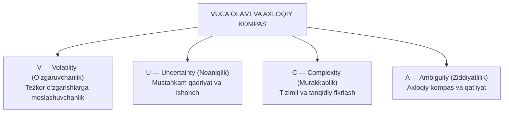

# 🌟 VUCA AXLOQ — Gamifikatsiyalashgan Ta’lim Platformasi

<p align="center">
  
</p>

<p align="center">
  <strong>9–11-sinf o‘quvchilarining VUCA sharoitida axloqiy dunyoqarashini rivojlantirishga qaratilgan innovatsion EdTech ta’lim platformasi</strong>
</p>

<p align="center">
  
  
  
  
  
  
  
</p>

---

## 📌 Mundarija
1. [Loyiha Haqida](#-loyiha-haqida)
2. [Loyiha Rahbari va Dastur Maqsadi](#-loyiha-rahbari-va-dastur-maqsadi)
3. [VUCA Konsepsiyasi Nima?](#-vuca-konsepsiyasi-nima)
4. [Duolingo 1:1 Animatsiyalari va Interfeys](#-duolingo-11-animatsiyalari-va-interfeys)
5. [Asosiy Funksional Imkoniyatlar](#-asosiy-funksional-imkoniyatlar)
6. [Loyiha Arxitekturasi va Tuzilishi](#-loyiha-arxitekturasi-va-tuzilishi)
7. [O‘rnatish va Ishga Tushirish](#-ornatish-va-ishga-tushirish)
8. [Statik va Media Fayllar Boshqaruvi](#-statik-va-media-fayllar-boshqaruvi)
9. [Admin Boshqaruv Paneli (Jazzmin)](#-admin-boshqaruv-paneli-jazzmin)
10. [Litsenziya va Mualliflik Huquqlari](#-litsenziya-va-mualliflik-huquqlari)

---

## 🎯 Loyiha Haqida

**VUCA Axloq** — zamonaviy o‘quvchilar (9–11-sinflar) uchun mo‘ljallangan, o‘rganish jarayonini zerikarli darslardan qiziqarli o‘yinga aylantiruvchi gamifikatsiyalashgan zamonaviy ta’lim platformasi.

Tizim jahonga mashhur **Duolingo** ta’lim platformasining ilg‘or UI/UX prinsiplari, interaktiv vektorli Lottie animatsiyalari, tabiiy audio sintezatori, bosqichma-bosqich o‘rganish yo‘li (Gamified Path), mukofotlar va tajriba ballari tizimini o‘zida mujassam etgan.

---

## 👩‍🏫 Loyiha Rahbari va Dastur Maqsadi

* **Loyiha Rahbari:** **Xasanova Bo‘rigul Hasan qizi**
* **Yo‘nalish:** Pedagogika, psixologiya va axloqiy tarbiya metodikasi
* **Asosiy Maqsad:** Shiddat bilan rivojlanayotgan, noaniq va o‘zgaruvchan axborot asrida (VUCA muhitida) yosh avlodning ongli mustaqil qaror qabul qilish, tanqidiy fikrlash, halollik, mas’uliyat va mustahkam ma’naviy-axloqiy immunitetini tizimli ravishda shakllantirish.

---

## 🧭 VUCA Konsepsiyasi Nima?

Platforma dunyo tan olgan VUCA modeli doirasida o‘quvchilarning 4 ta tayanch kompetensiyasini rivojlantiradi:



---

## 🦉 Duolingo 1:1 Animatsiyalari va Interfeys

Platformaning bosh sahifasida Duolingo (`https://ru.duolingo.com/`) rasmiy portalidan olingan va loyiha mavzusiga to‘liq moslashtirilgan **6 ta interaktiv Lottie SVG animatsiyasi** uzluksiz, silliq 30 FPS chastotada ishlaydi:

1. **Mutlaqo bepul, qiziqarli va samarali ta’lim (`effective_lottie.json`)** — Qanot qoqib sakrovchi, o‘quvchini quvnoq tabassum bilan kutib oluvchi Duo boyo‘g‘lisi.
2. **Ilmiy-pedagogik yondashuv (`science_lottie.json`)** — Oq laboratoriya xalatida, himoya ko‘zoynagini taqqan, tajriba kolbalarida suyuqliklar qaynayotgan aqlli Duo.
3. **Ta’limga kuchli rag‘bat va motivatsiya (`motivation_lottie.json`)** — Olovli kunlik seriya (Streak), qimmatbaho olmoslar va yutuq nishonlari.
4. **Har bir o‘quvchiga individual yondashuv (`personalized_lottie.json`)** — Moslashuvchan ta’lim kartalari va jonli qahramon harakatlari.
5. **Istalgan vaqtda va istalgan joyda ta’lim (`anytime_lottie.json`)** — Noutbuk, planshet, smartfon va shahar manzarasi uyg‘unlashgan keng panoramik harakatlanuvchi animatsiya.
6. **VUCA olamida o‘z kelajagingizni quring! (`bottom_lottie.json`)** — Pastki CTA chaqiruv banneridagi bayramona jamoaviy animatsiya.

### 🌀 Scroll (Tepaga / Pastga) Dinamikasi
* Sahifa aylantirilganda elementlarga dinamik ravishda `data-scroll-dir="down"` va `data-scroll-dir="up"` yo‘nalishi ulanadi.
* 3D parallaks va nozik burchakli burilishlar (`transform: translate3d(...) rotate(...) scale(...)`).
* Faol scroll qilinganda Lottie animatsiyalarining ijro tezligi dinamik ravishda 1.35x gacha oshadi va harakat to‘xtaganda 1.0x ga silliq qaytadi.
* CSS `@keyframes duoFloatSway` orqali kanvaslar sahifada doimiy ravishda yengil tebranib turadi.

---

## ✨ Asosiy Funksional Imkoniyatlar

### 🌓 1. Tungi va Kunduzgi Rejim (Dark / Light Mode)
* Yuqori sarlavhada (Desktop va Mobile header) hamda mobil menyu ichida quyosh/oy tugmasi (`data-theme-toggle`).
* Barcha fonlar, matnlar, kartochkalar, chegaralar va soyalar bir zumda o‘zgaradi.
* Tanlov brauzerning `localStorage` xotirasida eslab qolinadi va barcha tugmalar sinxron yangilanadi.

### 📱 2. Mobil Moslashuvchanlik & Gamburger Menyu
* Kichik ekranli qurilmalarda sarlavhada ixcham `.mobile-actions` paneli (Mavzu tugmasi, Ovoz tugmasi, Gamburger menyu).
* Gamburger tugmasi bosilganda silliq ochiladi (`☰` ➔ `✕`).
* Menyu ichidagi har qanday havola bosilganda yoki tashqi sohaga bosilganda avtomatik yopiladi.
* Pastki navigatsiya paneli (`.bottom-nav`).

### 🔊 3. Duolingo Web Audio Synthesizer
Tashqi og‘ir audio fayllarsiz, toza brauzer Web Audio API osillyatorlari orqali Duolingo tovushlari:
* **Taktil pop tovushi:** Tugmalar, kartochkalar va filtrlarni bosganda (440–580 Hz).
* **G‘alaba akkordi:** Dars yoki test yakunida 4 ta notadan iborat tantanali major akkordi (C5, E5, G5, C6).
* **Fanfare sadosi:** Mukofot sandiqlari ochilganda 5 ta notali tantana.
* Ovozni bir zumda yoqish/o‘chirish tugmasi (`data-sound-toggle`).

### 🖼️ 4. 20 ta Infografika Uchun Slayder & Lightbox Modal
* 20 ta microlearning infografikasini avtomatik va qo‘lda aylantirish karuseli.
* Pauza / Play (avtomatik aylanishni to‘xtatish va davom ettirish) boshqaruvi.
* Slayder harakatlanganda sahifa sakrab ketishining (scroll-jump) to‘liq oldi olingan.
* **To‘liq Ekran Lightbox Modali:** Har qanday infografikani to‘liq ekranda o‘qish, `Escape` va strelkalar orqali ko‘rish, rasmni yuklab olish imkoniyati.

### 📄 5. 20 ta Rasmiy Me’yoriy Hujjatlar (Word & PDF)
* 6 toifali interaktiv filtr:
  1. *Barchasi* (20 ta)
  2. *Word fayllar (.docx)* (10 ta ko‘k nishon bilan)
  3. *PDF hujjatlar (.pdf)* (10 ta qizil nishon bilan)
  4. *Kurs dasturlari*
  5. *Ish rejalari*
  6. *Huquqiy asoslar*
* `DEBUG=False` holatida ham barcha 40 ta media fayl (20 ta rasm, 20 ta hujjat) HTTP 200 OK bilan uzluksiz yuklanadi.

### 🐼 6. Motivatsion Panda Maskot
* 8 ta chuqur mazmunli VUCA iqtiboslarining navbatma-navbat chiqishi.
* Bosilganda elastik deformatsiya ("squish & stretch"), dialog pufagi tebranishi, quvnoq pop ovozi va uchuvchi rag‘bat zarralari (`⚡ +10 XP`, `🔥 Zo‘r!`, `💎 +1 Olmos!`).

### 🗺️ 7. O‘rganish Yo‘li (Gamified Learning Path)
* Modullar va darslar bo‘yicha interaktiv bosqichlar zanjiri.
* Har bir modul oxirida ochiladigan qimmatbaho sovg‘a sandiqlari (Unit Chests).
* Darslar yakunida test sinovlari, tajriba ballari (XP), seriyalar (Streak) va avtomatik diplom/sertifikat generatsiyasi.
* Mahalliy xavfsiz konfetti tizimi (`static/js/confetti.min.js`).

---

## 🏗️ Loyiha Arxitekturasi va Tuzilishi

```text
tyutors-site-for-yashin-aka/
├── Tyutors/                   # Django loyiha asosiy sozlamalari
│   ├── settings.py            # Xavfsiz sozlamalar, Whitenoise, Jazzmin
│   ├── urls.py                # Asosiy marshrutlar, media/static xizmati
│   ├── wsgi.py & asgi.py      # WSGI / ASGI konfiguratsiyasi
├── core/                      # Asosiy platforma ilovasi
│   ├── models.py              # Module, Course, Test, SiteDocument, Infographic
│   ├── views.py               # Asosiy sahifa, darslar, testlar, sertifikatlar
│   ├── urls.py                # Ilova ichki marshrutlari
│   ├── admin.py               # Jazzmin admin interfeysi
│   ├── fixtures/              # initial_data.json (barcha ma'lumotlar zaxirasi)
├── static/                    # Ishchi statik fayllar
│   ├── css/app.css            # Asosiy dizayn, Duolingo mavzulari, dark mode
│   ├── js/app.js              # Barcha interaktiv skriptlar, audio, parallaks
│   ├── js/lottie.min.js       # Lottie Bodymovin dvigateli
│   ├── js/confetti.min.js     # Mahalliy bayramona konfetti skripti
│   ├── duo_splash/            # 6 ta Lottie JSON va SVG qahramonlar
│   └── img/                   # Panda logotipi, qahramon suratlari
├── staticfiles/               # Whitenoise tomonidan siqilgan statik paketlar
├── media/                     # 20 ta infografika (.png) va 20 ta hujjat (.docx/.pdf)
├── templates/                 # HTML shablonlari
│   ├── base.html              # Bosh layout, navigatsiya, audio va kesh boshqaruvi
│   ├── learning_platform/     # Modullar, darslar, testlar, sertifikatlar
├── ai/                        # AI yordamida bajarilgan ishlar hisoboti
│   ├── LOYIHA_HISOBOTI.md     # Keng qamrovli loyiha texnik hisoboti
│   └── README.md              # Hisobot indeksi
├── manage.py                  # Django boshqaruv skripti
└── requirements.txt           # Kerakli Python kutubxonalari
```

---

## 🚀 O‘rnatish va Ishga Tushirish

### 1. Repozitoriyni klonlash:
```bash
git clone https://github.com/cipher-edu/Bo-rigul-apa-vuca.git
cd Bo-rigul-apa-vuca
```

### 2. Virtual muhit yaratish va faollashtirish:
```bash
# Windows:
python -m venv venv
venv\Scripts\activate

# Linux / MacOS:
python3 -m venv venv
source venv/bin/activate
```

### 3. Kutubxonalarni o‘rnatish:
```bash
pip install -r requirements.txt
```

### 4. Ma’lumotlar bazasini sozlash:
```bash
python manage.py migrate
python manage.py loaddata initial_data
```

### 5. Statik fayllarni yig‘ish:
```bash
python manage.py collectstatic --noinput
```

### 6. Loyihani ishga tushirish:
```bash
python manage.py runserver 127.0.0.1:8000
```
Brauzerda oching: **`http://127.0.0.1:8000/`**

---

## 🗄️ Statik va Media Fayllar Boshqaruvi

Loyiha ishlab chiqarish (production) muhitiga to‘liq tayyorlangan:
* **Whitenoise:** Statik fayllarni gzip va brotli formatlarida avtomatik siqib, keshlab uzatadi.
* **Media xizmati:** `DEBUG=False` holatida ham Word va PDF fayllar to‘g‘ridan-to‘g‘ri yuklanishi uchun `Tyutors/urls.py` da xavfsiz ichki xizmat ko‘rsatuvchi marshrut joriy qilingan.
* **Cache-Busting:** Brauzerlar yangilangan JavaScript va CSS fayllarni bir zumda olishi uchun `app.js?v=3.5` versiyalash mexanizmi integratsiya qilingan.

---

## 🛡️ Admin Boshqaruv Paneli (Jazzmin)

* Manzil: **`http://127.0.0.1:8000/admin/`**
* Zamonaviy **Jazzmin** dizayni asosida yaratilgan admin panel orqali quyidagilarni oson boshqarish mumkin:
  - Modullar va dars mavzularini kiritish/tahrirlash;
  - Interaktiv test savollari va to‘g‘ri javoblarni belgilash;
  - 20 ta infografika rasmlarini yangilash;
  - Yangi Word (.docx) va PDF (.pdf) rasmiy hujjatlarni yuklash;
  - O‘quvchilar natijalari va berilgan sertifikatlarni monitoring qilish.

---

## 📜 Litsenziya va Mualliflik Huquqlari

* **Loyiha nomi:** VUCA-konseptida axloq — 9–11-sinf o‘quvchilari uchun o‘quv kursi
* **Loyiha rahbari:** **Xasanova Bo‘rigul Hasan qizi**
* Mazkur ta’limiy dasturiy ta’minot va metodik materiallar mualliflik huquqi bilan himoyalangan.

---
<p align="center">
  <strong>© 2026 VUCA Axloq Ta’lim Platformasi. Barcha huquqlar himoyalangan.</strong>
</p>
